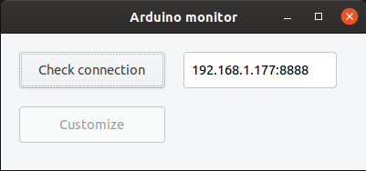
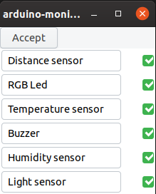
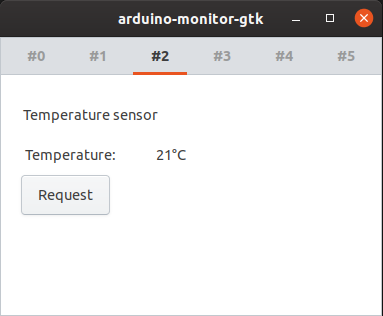
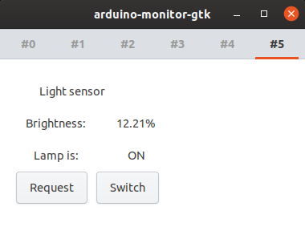

  <h1><code>Rust + GTK + Arduino </code></h1>

  <strong>Desktop interface created in Rust based on <a href="https://github.com/receek/Projekt_PO">Arduino sensors set</a>.</strong>

<h3> How to start project: </h3>

In root directory run: cargo run 

Cargo may need to install additional system packages, like <code>libgtk-3-dev</code>, then run in terminal:   
> <code>sudo apt install libgtk-3-dev</code>

<h2 align="center"> App view</h2>

